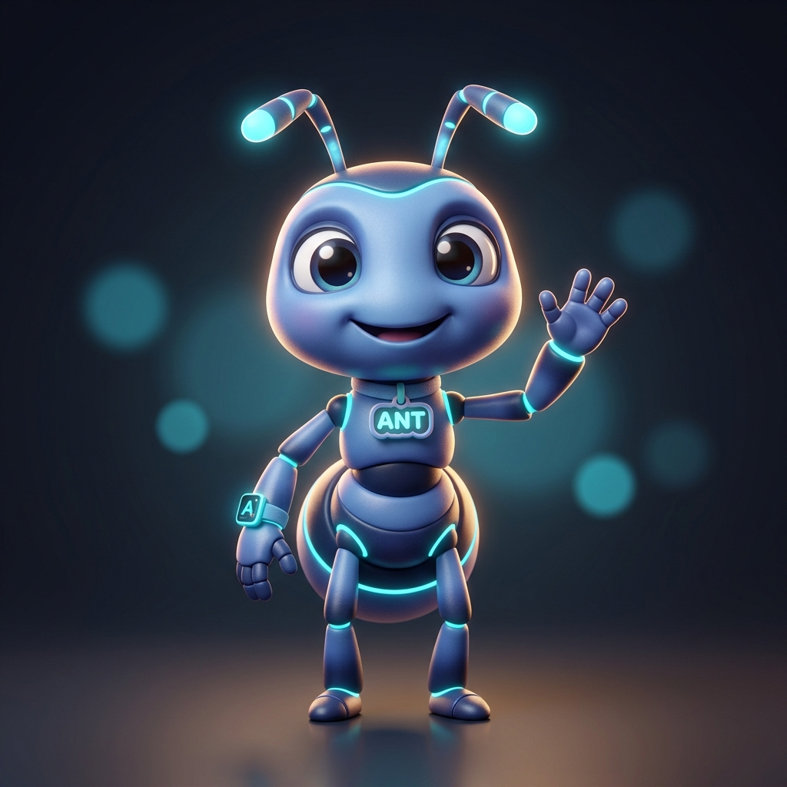

# VirtualDouble — AI Cognitive Body Doubler

<div align="center">



**An AI-powered focus companion that adapts to you, not the other way around.**

[Demo](#demo) • [Features](#features) • [How It Works](#how-it-works) • [Tech Stack](#tech-stack) • [Getting Started](#getting-started)

</div>

---

## 🎯 What is VirtualDouble?

VirtualDouble is a **neurodivergent-friendly focus companion** designed to help people with ADHD traits (and anyone who struggles with focus) enter, maintain, and return to deep work.

Instead of acting like a rigid productivity timer, VirtualDouble behaves like a **supportive virtual coworker** — one who:

- **Notices when you're present** and greets you warmly
- **Uses positive rituals** (smile detection) to start sessions intentionally
- **Watches your engagement** through computer vision (optional, privacy-first)
- **Checks in gently** when you might be disengaging — without judgment
- **Helps you return** to the task after distraction or fatigue
- **Celebrates your progress** when you complete a session

> **Core Philosophy:** Most productivity tools track your time. VirtualDouble responds to you.

---

## ✨ Key Features

### 🤖 ANT Mascot Companion
A friendly AI character (ANT) that provides warm, non-judgmental guidance throughout your work session.

### 😊 Positive Start Ritual
Begin sessions with a smile detection ritual — a deliberate, human transition that feels intentional rather than mechanical.

### 👁️ Privacy-First Computer Vision
- **Fully browser-side** processing using MediaPipe Face Landmarker (WebAssembly + GPU)
- **No video upload** — all camera frames processed and discarded on your device
- **Behavioral cues only** — detects head pose, presence, and smile geometry (never claims to know emotions)
- **Opt-in per session** — start without camera anytime

### 🪟 Document Picture-in-Picture
The focus companion floats in a persistent mini-window while you work in VS Code, Google Docs, browsers, or any other app.

### 🧠 Adaptive Check-Ins
When disengagement cues persist (sustained head-down posture or prolonged absence), ANT gently asks:
- "Want a quick check-in?"
- "Anything getting in the way?"
- Offers support: break tasks down, take a short break, or continue

### 🔄 Recovery-Oriented Design
Distraction is **not treated as failure**. The system focuses on making it easier to **return** to the task, not punishing drift.

### 📋 Smart Task Breakdown
Optionally breaks larger tasks into micro-steps (5–50 minutes each) based on task type:
- **Writing:** Outline → Draft → Review → Final check
- **Coding:** Review requirements → Implement → Test → Polish
- **Research:** Define focus → Work through material → Notes → Review
- **Generic:** Clarify → First chunk → Core task → Wrap up

### ⏱️ Flexible Session Management
- Presets: 5, 10, 15, 25, or 50 minutes
- Custom durations (1–180 minutes)
- Pause/resume with context preservation
- Add +5 min on the fly

---

## 🎬 Demo

**Flow Overview:**

1. **Welcome Screen** — ANT greets you and asks what you want to work on
2. **Task Entry** — Enter your task and choose a session length
3. **Smile Ritual** — The camera detects your smile when you're ready (or skip it)
4. **Focus Session** — Work while the companion stays visible in a floating window
5. **Adaptive Monitoring** — ANT watches for disengagement cues (if camera is enabled)
6. **Check-In (if needed)** — Gentle intervention after 10 seconds of sustained non-focus
7. **Completion Celebration** — Positive reinforcement when the session ends

---

## 🧩 How It Works

### Computer Vision Pipeline

```
getUserMedia (320×240 camera)
  ↓
MediaPipe Face Landmarker (WebAssembly + GPU/CPU)
  ↓
478 3D landmarks + face transform + 52 blendshapes
  ↓
Head pose extraction (pitch/yaw/roll Euler angles)
  ↓
Neutral-pose calibration (1.8s median baseline)
  ↓
Exponential smoothing (EMA α=0.35)
  ↓
Angular hysteresis + dwell-time state machine
  ↓
Focus state: focused | possibly_distracted | away
  ↓
10-second continuous non-focus episode tracker
  ↓
ANT check-in (pause session, show support UI)
```

**Key Thresholds (tunable in `lib/vision/config.ts`):**
- **Head-down enter/exit:** +22° / +14° relative pitch
- **Looking-away enter/exit:** ±32° / ±22° relative yaw (observable, not used for intervention)
- **Away dwell:** 3.0s continuous face absence
- **Distracted dwell:** 2.0s continuous head-down pose
- **Recovery dwell:** 1.5s stable presence before returning to "focused"
- **Check-in trigger:** 10 seconds of continuous `possibly_distracted` or `away`

### Document Picture-in-Picture

VirtualDouble uses the **Document Picture-in-Picture API** (Chrome 116+) to float a mini-window containing:
- ANT avatar
- Current task
- Countdown timer
- Pause/resume controls
- Check-in UI (when triggered)

**Behavior:**
- Auto-opens when you minimize or switch away from the main window
- Auto-closes when you return to the main tab
- Continues camera inference while PiP is visible (even if main tab is hidden)
- Syncs theme (light/dark) with the main document

---

## 🛠️ Tech Stack

### Frontend
- **Framework:** [Next.js 16.3](https://nextjs.org/) (React 19.2, App Router)
- **Language:** TypeScript 5
- **Styling:** Tailwind CSS 4 + shadcn/ui components
- **Icons:** Lucide React
- **Fonts:** Inter (sans-serif), Playfair Display (serif accents)

### Computer Vision
- **Model:** [MediaPipe Face Landmarker](https://developers.google.com/mediapipe/solutions/vision/face_landmarker) 1.0.1
- **Runtime:** WebAssembly with GPU delegate (CPU fallback)
- **Model size:** 3.59 MiB (face_landmarker.task)
- **Inference rate:** 10 FPS (intentionally throttled)
- **Capabilities:** 478 3D landmarks, facial transform matrix, 52 blendshapes

### APIs
- **Camera:** `getUserMedia` (WebRTC)
- **Floating window:** Document Picture-in-Picture API
- **Media Session:** Chrome Auto-PiP qualification
- **Audio keep-alive:** Inaudible audio track for PiP eligibility

### AI (Optional, Dormant)
- **Provider:** OpenAI SDK (GPT-5.6-terra via Responses API)
- **Purpose:** Task-time recommendation groundwork (not used in current demo)
- **Fallback:** Deterministic local heuristics (email: 15min, coding: 25min, research: 40min)

### Deployment
- **Platform:** [Vercel](https://vercel.com/)
- **Analytics:** Vercel Analytics (production only)
- **Environment:** Node.js runtime for API routes

---

## 🚀 Getting Started

### Prerequisites
- **Node.js 20+** (or any version supporting `--experimental-strip-types`)
- **Modern browser:** Chrome/Edge 116+ recommended (for Document PiP)
- **Camera:** Optional, for vision-based monitoring

### Installation

1. **Clone the repository:**
   ```bash
   git clone https://github.com/evice2457/AdaptiveNeuralTechnology.git
   cd AdaptiveNeuralTechnology/Hackathon-ANT/virtual-double
   ```

2. **Install dependencies:**
   ```bash
   npm install
   ```

3. **(Optional) Configure OpenAI API key:**
   
   If you want to test the dormant AI recommendation route, create `.env.local`:
   ```bash
   OPENAI_API_KEY=sk-...
   ```
   **Note:** The visible demo does **not** require this. It uses deterministic local task breakdown.

4. **Run the development server:**
   ```bash
   npm run dev
   ```

5. **Open the app:**
   ```
   http://localhost:3000
   ```

   **Important:** Use `localhost` or HTTPS. Browsers block camera access on insecure remote origins.

---

## 🧪 Testing

```bash
# Vision subsystem tests
npm run test:vision

# ANT AI recommendation tests
npm run test:ant-ai

# Core logic tests (task breakdown, support, check-in, mascot)
npm run test:demo

# Lint
npm run lint

# Production build
npm run build
```

---

## 📁 Project Structure

```
virtual-double/
├── app/
│   ├── page.tsx              # Main app shell & session orchestration
│   ├── layout.tsx            # Root layout, metadata, fonts
│   ├── globals.css           # Tailwind base styles
│   └── api/
│       └── ant/recommend-time/
│           └── route.ts      # OpenAI time recommendation API (dormant)
├── components/
│   ├── AntWelcomeView.tsx    # Initial greeting screen
│   ├── MicroCommitmentView.tsx  # Task entry + session length picker
│   ├── SmileRitualView.tsx   # Positive start ritual (camera + smile)
│   ├── DeepPresenceView.tsx  # Main session view (countdown, controls)
│   ├── AntCheckIn.tsx        # Check-in modal (pause + support)
│   ├── SessionCompletionModal.tsx  # Celebration screen
│   ├── PipWindow.tsx         # Document PiP content portal
│   ├── VisionMonitor.tsx     # CV context bridge + debug panel
│   ├── StepTransitionView.tsx  # Multi-step plan transitions
│   ├── Header.tsx            # App header + theme toggle
│   ├── InteractiveBackground.tsx  # Animated gradient particles
│   └── ui/                   # shadcn/ui primitives (Button, Input)
├── lib/
│   ├── focus-session.tsx     # Session state reducer + context provider
│   ├── task-breakdown.ts     # Deterministic multi-step plan creation
│   ├── ant-support.ts        # Check-in support message logic
│   ├── check-in.ts           # Check-in state machine
│   ├── check-in-episode.ts   # 10-second episode tracker
│   ├── use-distraction-watch.ts  # Focus state → check-in trigger
│   ├── use-document-pip.ts   # Document PiP lifecycle hook
│   ├── floating-companion.tsx  # PiP API context
│   ├── session-clock.ts      # Clock reconciliation
│   ├── ant-voice.ts          # Audio keep-alive for PiP
│   ├── mascot-name.tsx       # ANT name context
│   ├── mascot-presentation.ts  # ANT character logic
│   ├── vision/
│   │   ├── config.ts         # All CV thresholds (tunable)
│   │   ├── face-landmarker.ts  # MediaPipe model singleton
│   │   ├── head-pose.ts      # Transform → Euler angles
│   │   ├── signals.ts        # Blendshape extraction + EMA
│   │   ├── temporal-filter.ts  # State machine (focused/distracted/away)
│   │   ├── use-vision-monitor.ts  # Camera lifecycle hook
│   │   ├── smile-ritual.ts   # Smile detection heuristics
│   │   ├── use-smile-ritual.ts  # Smile ritual hook
│   │   └── types.ts          # Vision observation types
│   └── ant-ai/
│       ├── provider.ts       # Time recommendation interface
│       ├── openai-provider.ts  # OpenAI SDK adapter
│       ├── fallback.ts       # Local heuristic fallback
│       └── types.ts          # Recommendation types
├── public/
│   ├── mediapipe/
│   │   ├── models/
│   │   │   └── face_landmarker.task  # MediaPipe model (3.59 MiB)
│   │   └── wasm/
│   │       ├── vision_wasm_internal.{js,wasm}
│   │       ├── vision_wasm_nosimd_internal.{js,wasm}
│   │       └── vision_wasm_module_internal.{js,wasm}
│   └── ant-*.png             # ANT mascot images
├── docs/
│   ├── vision.md             # CV architecture deep dive
│   └── ant-ai.md             # AI recommendation groundwork
├── main.md                   # Product concept document
├── UI_CHANGES.md             # Session change log
├── package.json
├── tsconfig.json
└── next.config.ts
```

---

## 🔒 Privacy & Ethics

### What VirtualDouble Does NOT Do:
- ❌ **Upload camera frames** — all processing happens on your device
- ❌ **Store video or photos** — frames are processed and immediately discarded
- ❌ **Claim to detect emotions** — only observable geometry (head pose, smile shape)
- ❌ **Diagnose ADHD or mental health** — not a medical device
- ❌ **Track productivity scores** — no gamification or surveillance metrics
- ❌ **Force you to work** — you remain in control; ANT only suggests

### What It Does:
- ✅ **Observes behavioral cues** (face presence, head orientation, smile geometry)
- ✅ **Respects camera opt-out** — you can start sessions without vision monitoring
- ✅ **Processes locally** — MediaPipe runs in your browser (WebAssembly)
- ✅ **Syncs theme/state to localStorage** — session data never leaves your device
- ✅ **Uses support language** — "Want a check-in?" not "You are distracted"

**Note:** MediaPipe Tasks SDK may send non-image performance/utilization metrics to Google. See the [MediaPipe privacy notice](https://github.com/google-ai-edge/mediapipe#privacy-notice).

---

## 🎨 Design Principles

1. **Support, not surveillance** — The user should feel helped, not evaluated
2. **Observe behavior, don't diagnose emotion** — Detect geometry, not feelings
3. **User remains in control** — ANT suggests; you decide
4. **Reduce friction** — Every interaction should make continuing easier
5. **Positive reinforcement** — Celebrate progress, not punishment
6. **Minimal interruption** — The best companion is often quiet
7. **Personal adaptation** — (Future) Learn each user's normal focus patterns

---

## 🧠 What VirtualDouble Is For

VirtualDouble is designed for people who struggle with:
- **Starting** — Overcoming initial activation energy
- **Maintaining engagement** — Staying with a task when it gets hard
- **Recovering after interruption** — Getting back on track after drift
- **Managing fatigue** — Recognizing when to take a break
- **Returning to momentum** — Re-entering focus after losing it

**It is NOT:**
- A medical diagnostic tool
- ADHD treatment
- An emotion detector
- Employee surveillance software
- A productivity scoring system

---

## 🗺️ Roadmap

### Current Version (v0.1.0)
- ✅ ANT mascot companion
- ✅ Smile ritual start
- ✅ Browser-side computer vision (MediaPipe)
- ✅ Document Picture-in-Picture floating window
- ✅ Adaptive check-ins (10s non-focus threshold)
- ✅ Deterministic task breakdown (writing/coding/research/email/generic)
- ✅ Session persistence (localStorage)
- ✅ Light/dark theme

### Future Ideas
- 🔮 **Personalized learning** — Adapt to each user's normal focus patterns
- 🔮 **Voice interaction** — Speak tasks instead of typing
- 🔮 **Multi-session history** — Track patterns over days/weeks
- 🔮 **Break suggestions** — Smart break timing based on fatigue cues
- 🔮 **Mobile app** — iOS/Android companion
- 🔮 **Desktop app** — Electron wrapper for native OS integration
- 🔮 **Pomodoro mode** — Optional structured intervals
- 🔮 **Team co-working** — Virtual co-working rooms

---

## 🤝 Contributing

This project was built for the **Adaptive Neural Technology (ANT) Hackathon**. 

If you'd like to contribute:
1. Fork the repository
2. Create a feature branch (`git checkout -b feature/amazing-feature`)
3. Commit your changes (`git commit -m 'Add amazing feature'`)
4. Push to the branch (`git push origin feature/amazing-feature`)
5. Open a Pull Request

**Areas we'd love help with:**
- 🧪 Testing on different browsers/devices
- 📱 Mobile browser compatibility
- ♿ Accessibility improvements (WCAG 2.1 AA)
- 🌍 Internationalization (i18n)
- 📊 User studies with neurodivergent folks

---

## 📄 License

This project is licensed under the **MIT License** — see the LICENSE file for details.

---

## 🙏 Acknowledgments

- **MediaPipe Team** — For the excellent Face Landmarker model and WebAssembly runtime
- **Next.js & Vercel** — For the modern web framework and deployment platform
- **shadcn/ui** — For beautiful, accessible component primitives
- **Tailwind CSS** — For rapid, maintainable styling
- **ADHD Community** — For inspiring the core philosophy of support over surveillance

---

## 📞 Contact

**Project Lead:** evice2457  
**Repository:** [AdaptiveNeuralTechnology/Hackathon-ANT](https://github.com/evice2457/AdaptiveNeuralTechnology)

---

<div align="center">

**Built with ❤️ for people who want to focus, not be judged.**

</div>
